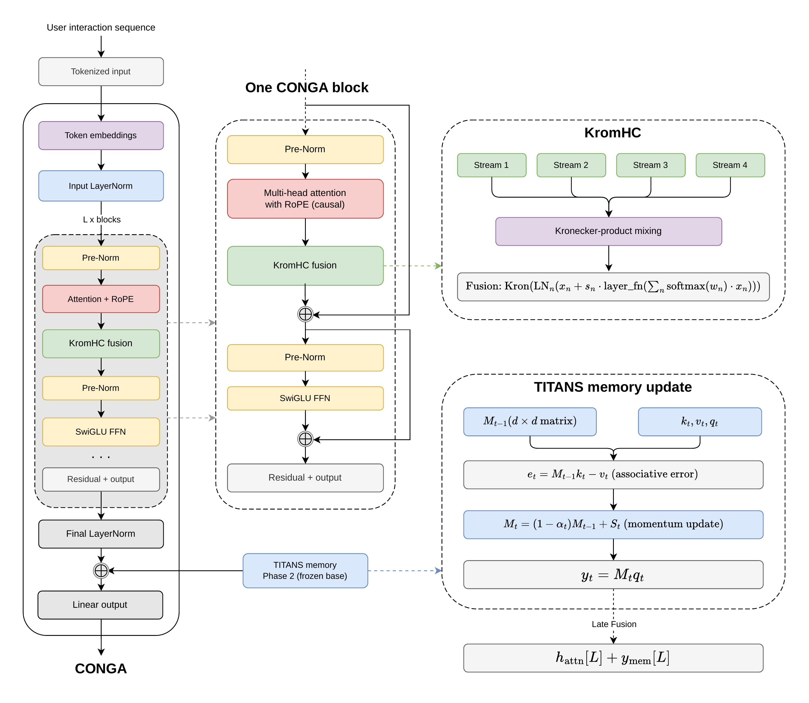

<div align=center>
<h1>CONGA: Continual Neural Gated Architecture for Long-History Sequential Recommendation</h1>

<!-- 
 [](https://arxiv.org/abs/XXXX.XXXXX) -->

<div>
    <a href="https://github.com/PrORain-HCMUS" target="_blank">Hoang Vu Le*</a>,
      <a href="https://github.com/nguyentuongbachhy" target="_blank">Tuong Bach Hy Nguyen*</a>,
      <a href="https://www.fit.hcmus.edu.vn/~lhbac/" target="_blank">Bac Le</a>,
    <div>
     University of Science, VNU-HCM, Vietnam
    </div>
</div>
</div>

---

This is the official PyTorch implementation of the RecSys 2026 paper "CONGA: Continual Neural Gated Architecture for Long-History Sequential Recommendation".


## Overview
Sequential recommenders built on absolute positional encodings and fixed context windows (e.g. SASRec) suffer from two structural failure modes: **positional out-of-distribution degradation** once a user's history exceeds the training window, and **hard context limits** that discard long-range interaction signal. CONGA addresses both through three contributions layered on a modernized SASRec backbone:

1. **RoPE (Rotary Positional Embeddings)** - norm-preserving ($\|\mathcal{R}_m\|_F = \sqrt{d}$ for any sequence length), so representation quality doesn't degrade on histories longer than the training window. Accelerated by a custom fused CUDA kernel.
2. **KromHC multi-stream fusion** - exact doubly-stochastic stream mixing via a Kronecker-product parametrization, with a data-adaptive stream-count rule that prevents overfitting.
3. **TITANS neural associative memory** - extends the effective context window via a two-phase training protocol: the base encoder is frozen in Phase 2, giving a structural forgetting-prevention guarantee while a learned memory term is added on top.


## Updates
- (Jul 20, 2026) update README
- (Apr 13, 2026) add ablation study runner and benchmark scripts
- (Mar 16, 2026) Replaced mHC with a BSARec-inspired KromHC variant featuring per-stream residual connections and LayerNorm before Kronecker mixing with fused CUDA kernel
- (Mar 13, 2026) update evaluation from sampled ranking to full ranking
- (Feb 11, 2026) add TITANS memory module with two-phase training with fused CUDA kernel
- (Jan 11, 2026) add SwiGLU activation with fused CUDA kernel
- (Jan 10, 2026) Added mHC (Manifold-Constrained Hyper-Connections) with a fused CUDA kernel to reduce HBM memory traffic and kernel-launch overhead.
- (Jan 3, 2026) add RoPE rotary positional embeddings
- (Dec 21, 2025) initial release with SASRec backbone and baseline benchmarks

## Dataset
In our experiments, we utilize four datasets for evaluation, all stored in the `code/src/data` folder.
- For Beauty, Yelp, and Steam, we employed the datasets preprocessed following the protocol from [FMLP-Rec](https://github.com/Woeee/FMLP-Rec).
- For ML-1M, we processed the data according to the procedure outlined in [S3-Rec](https://github.com/RUCAIBox/CIKM2020-S3Rec).
- Additional datasets (Video, Wikipedia) are bundled for extended experiments.

| Dataset | Users | Items | Interactions | Avg. seq. length | Sparsity |
|:--------|------:|------:|--------------:|------------------:|---------:|
| Beauty  | 22,363 | 12,101 | 198,502   | 8.9   | 99.93% |
| Yelp    | 30,431 | 20,033 | 316,354   | 10.4  | 99.95% |
| Steam   | 88,310 | 3,581  | 1,251,751 | 14.2  | 99.60% |
| ML-1M   | 6,040  | 3,416  | 999,611   | 165.6 | 95.20% |

## Quick Start
### Environment Setting
```
cd code/src
uv sync --frozen --no-install-project
```

Build the CUDA extensions:
```
uv pip install --no-build-isolation \
  -e ./modules/rope -e ./modules/mhc -e ./modules/mhcv2 -e ./modules/swiglu -e ./modules/titans
```

### How to train CONGA
- Note that pretrained model (.pt) and train log file (.log) will be saved in the training directory
- `--train_dir`: directory name for log file and checkpoint file
```
uv run python main.py  --dataset [DATASET] \
                       --lr [LEARNING_RATE] \
                       --hidden_units [HIDDEN_DIM] \
                       --num_blocks [N_BLOCKS] \
                       --num_heads [N_HEADS] \
                       --train_dir [DIR_NAME]
```
- Example for ML-1M
```
uv run python main.py  --dataset ml-1m \
                       --lr 0.001 \
                       --hidden_units 64 \
                       --num_blocks 2 \
                       --num_heads 2 \
                       --train_dir exp_conga
```

### How to test pretrained CONGA
- Note that pretrained model (.pt file) must be in the training directory
- `--state_dict_path`: path to pretrained model checkpoint
```
uv run python main.py  --dataset [DATASET] \
                       --hidden_units [HIDDEN_DIM] \
                       --num_blocks [N_BLOCKS] \
                       --num_heads [N_HEADS] \
                       --state_dict_path [CHECKPOINT_PATH] \
                       --inference_only
```
- Example for ML-1M
```
uv run python main.py  --dataset ml-1m \
                       --hidden_units 64 \
                       --num_blocks 2 \
                       --num_heads 2 \
                       --state_dict_path exp_conga/SASRec.best.pth \
                       --inference_only
```

### How to train the baselines
- You can easily train the baseline models used in CONGA by changing the `model_type` argument.
    - `model_type`: sasrec, bsarec, bsarec_rope, bert4rec, gru4rec, fmlprec, duorec, fearec, wearec
- For the hyperparameters for the baselines, check the `parse_args()` function in `code/src/main.py`.
```
uv run python main.py  --model_type SASRec \
                       --dataset ml-1m \
                       --num_heads 2 \
                       --train_dir exp_sasrec_ml1m
```

## Citation
If you find our work useful, please consider citing our paper:
```
@inproceedings{le2026conga,
  title     = {CONGA: Continual Neural Gated Architecture for Long-History Sequential Recommendation},
  author    = {Le, Hoang-Vu and Nguyen, Tuong-Bach-Hy and Le, Bac},
  booktitle = {Proceedings of the ACM Conference on Recommender Systems (RecSys '26)},
  year      = {2026},
  address   = {Minneapolis, MN, USA},
  publisher = {ACM}
}
```

## Contact
If you have any inquiries regarding our paper or codes, feel free to reach out via email at [nguyentuongbachhy@gmail.com](mailto:nguyentuongbachhy@gmail.com).

## Acknowledgement
This repository is based on [SASRec](https://github.com/kang205/SASRec) and [FMLP-Rec](https://github.com/Woeee/FMLP-Rec).
